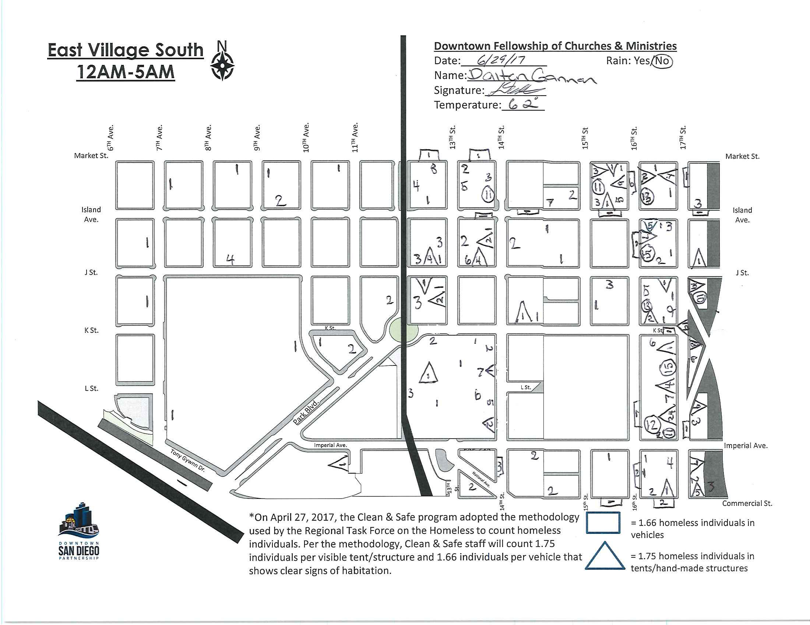

## Counting Downtown San Diego Homeless

For the last 7 years, the [Downtown San Diego
Partnership](https://downtownsandiego.org/) has been conducting monthly counts
of homeless in the Downtown neighborhood. The data is recorded on paper maps,
which are [compiled into a
spreadsheet.](https://downtownsandiego.org/wp-content/uploads/2019/02/January-20
19-Unsheltered-Homeless-Sleep-Count-Web-Version-Final-003.pdf) This is a
fantastic dataset which would be even more useful if the hand-recorded paper
maps were digitized.

This project involves collecting and digitizing 5 years of the monthly maps, to
produce a geographic dataset, whcih we will analyze for time trends and for the
association between homless movements, geography and the built environment.

The data has been collected and organized, and now we need volunteers to
georeference the maps and digitize them to produce gepgraphic datasets that we
can combine into a single dataset.

Here is one of the maps that we will digitize:

This project will involve:
* Extracting images for each of the neighborhood maps for each month.
* Geo-referencing
* Digitizing each of the count locations
* Combining all of the digitized datasets into a single combined dataset.
* Analyzing the combined data.

When the project is complete, we will have a monthly, geographically precise
accounting for the 500 to 1000 homeless people in the Downtown neighborhood,
about 20% of all unsheltered homeless in the county.

All of the maps for this project are [online in Google
Drive](https://drive.google.com/drive/u/3/folders/1mEhOX3k6vNi1CIrXDIZfxh0nGUM-pr9u).
 Last year, A student group at the Kearney High School of Science, Connections and
Technology are spending the end of the year digitizing and analyzing a few of the
neighborhoods. [See the maps and dataset results from this awesome student project.](https://www.sandiegodata.org/2019/06/homeless-in-the-gaslamp-district/) 

# Help with the Project

Getting involved in this project is really easy! [Visit our list of
tasks](https://github.com/sandiegodata-projects/downtown-partnership/issues) and select one
of the tasks. Everything you need, including detailed instructions, is linked from the
Github issues.

There are two major kinds of tasks: 

* Geo-refrerencing maps, to identify four road intersections on each map by placing ground
  control points. [See the detailed instructions for ground control point
  tasks.](https://docs.google.com/document/d/1Rh1EB405sHHgFKuIfyLE9JAA1VUPzOGa1_iUwfb8h6g/edi
  t?usp=sharing) 
* Digitizing handwritten homeless count marks, putting circles around
  numbers in the maps that indicates where homeless people were found. [See the detailed
  instructions for count digitization
  tasks.](https://docs.google.com/document/d/1E_ZJXS3GjzxOPLRHuTBhde-jQrbn4uc7D57YGoXlyuo/edi
  t?usp=sharing)

As we get data back for these two kinds of tasks, we'll use a program that analyzes the GCP
results to produce a transformation function that can convert the pixel locations of the
handwritten homeless count numbers into geographic positions ( latitude / longitude ). Then
we'll collect all of the data into a dataset for analysis.

## Special Thanks

Special thanks to volunteer digitizers: 

* Kelly Abbott
* Jorge Bonilla
* Marketne Noel 

# Joining the Project
* Email eric@sandiegodata.org that you'd like to join
* Attend one of the [Meetups](https://www.meetup.com/San-Diego-Regional-Data-Library/).

# Resources

* [Project management site](https://redmine.civicknowledge.com/projects/downtown-partnership-homeless)
* [Github Repository](https://github.com/sandiegodata-projects/downtown-partnership)
